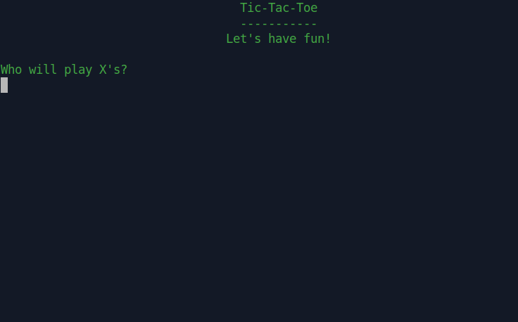

# Project: Tic-Tac-Toe

[](http://tic_tac_toe.pandenok.repl.run/)

I developed this command-line game while going through the Ruby Programming course (Intermediate Ruby: OOP) at The Odin Project.

Tic-tac-toe (American English), noughts and crosses (British English), or Xs and Os is a paper-and-pencil game for two players, X and O, who take turns marking the spaces in a 3×3 grid. The player who succeeds in placing three of their marks in a horizontal, vertical, or diagonal row is the winner. (aka "formal restatement of the problem")

### User interface

- CLI — Command Line Applications/Interface



### Version History

**2.0:** Aug 02, 2020 - Major refactor and automated testing suite

**1.0:** Jun 14, 2020 - see "What I learned section" for details

### Pseudocode

- The board has 9 empty squares
    -  The squares are allocated in form of a grid/table (3×3)
- There are 2 pieces of marks/tokens — X and O
- There are only 2 players: 
    - Human vs Human
    - Human vs Computer (not requested)

- Players take turns playing
- 1st turn — Player 1
- Player 1 places their token (X) in only 1 square of their choice
- 2nd turn — Player 2
- Player 2 places their token (O) in only 1 square of their choice, except they can’t touch the square that Player 1’s token already fills
- 3rd turn — Player 1 ... . and the cycle continues until a player wins or there’s a tie game
- There are 8 winning combinations: Top row, Middle row, Bottom row, Left column, Middle column, Right column, Left diagonal, and Right diagonal
- There’s a draw/tie when the entire board is filled with X’s and O’s but no winning combinations can be found

# What I learned

As always everything seems to make sense through the lessons and reading until you start applying what you’ve learned into projects... 

### Three Virtues

[read here](http://threevirtues.com/)

## Object-Oriented Programming (OOP)

### Classes, Objects and Methods

Although I’m understanding how classes operate, how to create new objects (instances), and how to get and set functionality, I was struggling with the concept. Why do I need Classes if I can build a solution without them at all? Here is the answer from Erik Trautman: 

> "When you find that you want the same method to be run on a bunch of different objects without having to make a bunch of different if/else or case statements, you should start thinking about using a class."

Erik on Classes, Objects and Methods:

>"Classes are like umbrellas that let us give an object general behaviors just based on what it is. An object is an instance of a class -- you (yes, you) are an instance of the Person class. There are lots of behaviors (methods) that you can do just by virtue of being a Person... #laugh, #jump, speak("hello")"

Instant of a Class is what the programm **has**

Method is what a Class **does**

Before adding new attributes or functions to our classes, we must determine whose **responsibility** it is to enact that behavior or attributes. So designing objects means either the class itself or the instances of the class is responsible for that object.

### Objects Relationships

The relationship between objects was not hard to understand through the readings, it was hard to define it in code! I’ve come across [this metaphoric explanation](https://medium.com/@christine_tran/oop-pt-3-object-relationships-46e940e4ce95) on how two classes (models) can relate to each other by belonging to (*"Every Song has an Artist"*) or having many of each other (*"Every Artist has many Songs"*). In addition, it gives some basic examples on how call methods on objects.

### Scoping

Build your game, taking care to not share information between classes any more than you have to.
```text
"You should change the default thought in your head from "everything is accessible, what do I need to hide?" to "everything should be hidden, what do I absolutely need to make externally available?""
```
## Refactoring

### Rubocop

Displays cop names in offense messages (`-D`), Auto-corrects offenses (`-a`) by Running only (`--only`) the specified cop(s) (`Layout/TrailingWhitespace`)
```
rubocop -D -a --only Layout/TrailingWhitespace
```
Rubocop pre-commit hook for Git: [text](https://devsimple.ru/posts/rubocop/) or [Youtube 9:32](https://www.youtube.com/watch?v=wtPkDjkMqz4)
### Methods should be SHORT!

## CLI Styling

### Colorized output to the terminal

[Stack Overflow answer](https://stackoverflow.com/questions/1489183/colorized-ruby-output-to-the-terminal)

### Tabular Output in Console

- `"\t"`
- `ljust(length)` filling the string with spaces to the same (maximum) length
- printf-style formatting 
`printf("%20s  %s", filename, (ok ? '[OK]' : '[FAILED]'))` 

### Printing out to the console without a line break/newline

- append `"\r"` at end of line to indicate "carriage return"
- `print` instead of `puts`. Can be followed up by `STDOUT.flush`, which flushes any buffered data within ios to the underlying operating system. `$STDOUT.print` `"no newline"` `$STDOUT.flush` produce `no newline`. ([SO](https://stackoverflow.com/questions/5080644/how-can-i-use-puts-to-the-console-without-a-line-break-in-ruby-on-rails/5080779#5080779))

